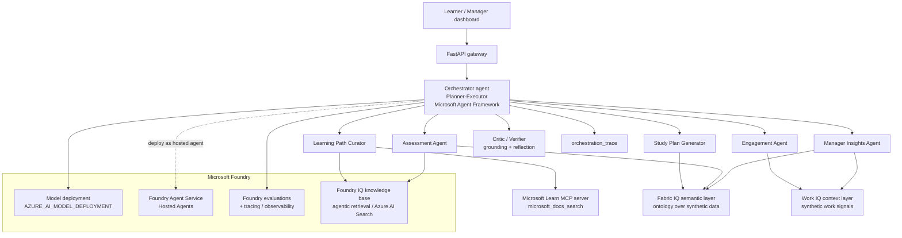

# CertMesh — Architecture

CertMesh is a multi-agent enterprise learning / certification-management system
built on the **Microsoft Agent Framework** and **Microsoft Foundry**. A
planner–executor orchestrator routes a learner or manager request to five
specialist agents and a cross-cutting critic/verifier, all grounded by three
Microsoft IQ layers (Foundry IQ as the required real layer; Work IQ and Fabric
IQ as concept-faithful layers) plus the Microsoft Learn MCP server.

> All data, identifiers and documents are **synthetic** (a fictional healthcare
> provider, "Northwind Health"). See [responsible-ai.md](responsible-ai.md).

## System diagram



## How CertMesh uses Microsoft Foundry

| Foundry capability | How CertMesh uses it | Real vs. concept-faithful |
|---|---|---|
| **Model deployment** | Agents call a Foundry-deployed model through the Agent Framework's `FoundryChatClient` for optional natural-language glosses. Model name in `AZURE_AI_MODEL_DEPLOYMENT` (default `gpt-4o`). | Real when configured; deterministic offline stub otherwise. |
| **Foundry IQ** | A knowledge base over the approved synthetic corpus, exposed to the Curator + Assessment agents as retrieve-and-cite. Azure AI Search when configured; local BM25 index with the identical citation contract otherwise. The managed path consumes the KB via the `knowledge_base_retrieve` MCP tool. | **Real layer** (Azure AI Search) with a faithful local fallback. See [iq-layers.md](iq-layers.md). |
| **Work IQ / Fabric IQ** | Concept-faithful context + semantic layers over synthetic signals, with a documented upgrade path to the managed products. | Concept-faithful. |
| **Hosted Agents** | The orchestrator is packaged as a container image → ACR → Foundry Agent Service (Entra agent identity, managed endpoint). | Documented + Dockerfile; runs locally without it. See [../deploy/deploy_hosted_agent.md](../deploy/deploy_hosted_agent.md). |
| **Evaluations + tracing** | Every agent call runs inside an OpenTelemetry span (bridged to Foundry tracing / Azure Monitor when configured). The eval harness integrates the managed `azure-ai-evaluation` `GroundednessEvaluator`/`RelevanceEvaluator` when available, with always-on local evaluators as the CI gate. | Real when configured; local evaluators otherwise. |
| **Microsoft Learn MCP** | The Curator calls the public Learn MCP server (`microsoft_docs_search`) for real, cited Microsoft Learn content. | Real (public, no auth); offline cache of real Learn URLs as fallback. |

## Request lifecycle

1. **FastAPI gateway** (`app/api.py`) receives a `LearningRequest` and calls the orchestrator.
2. **Orchestrator** (`src/certmesh/orchestrator.py`) detects language, resolves the certification/role/learner/capacity from the IQ layers, and **plans** which specialists to run (the routing decision is the first trace step).
3. **Specialists** run in sequence; **grounded** agents (Curator, Assessment) pass through the **critic** before their output is accepted — an ungrounded claim triggers a bounded **reflection loop** or an abstain.
4. The orchestrator assembles an `OrchestrationResult` with a full `OrchestrationTrace` (every agent, its sources, critic verdicts, reflections, and timings).

See [orchestration.md](orchestration.md) for the planner–executor + critic detail and the trace format, [agents.md](agents.md) for each agent's contract, and [iq-layers.md](iq-layers.md) for the IQ layers.

## Code map

```
src/certmesh/
  orchestrator.py     planner–executor + reflection loop + trace assembly
  schemas.py          Pydantic contracts for every I/O + the trace
  config.py           env-driven, cloud-optional configuration
  agents/             curator, study_plan, engagement, assessment, manager_insights, critic
  iq/                 foundry_iq (real), work_iq, fabric_iq (concept-faithful)
  tools/ms_learn_mcp  Microsoft Learn MCP client
  foundry/            model backend (Agent Framework) + OTel tracing
app/                  FastAPI gateway + single-page dashboard
evals/                gold cases + local evaluators + Foundry eval SDK path
deploy/               Dockerfile + hosted-agent runbook
```
